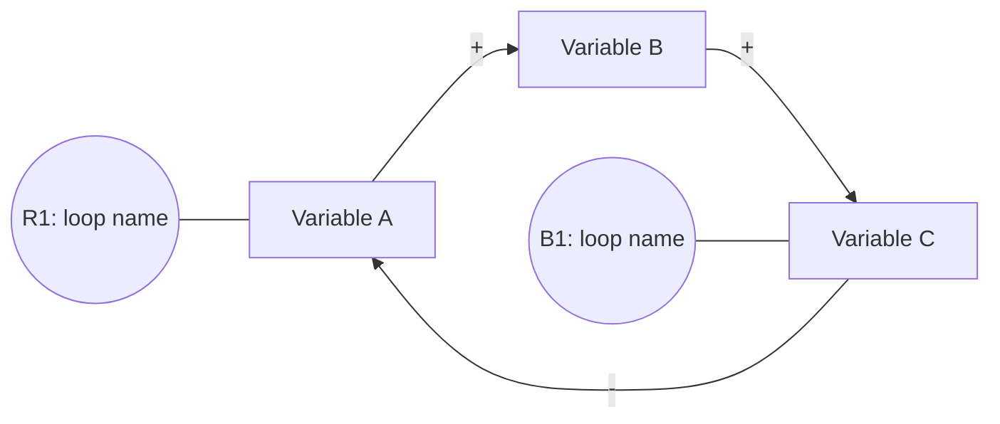
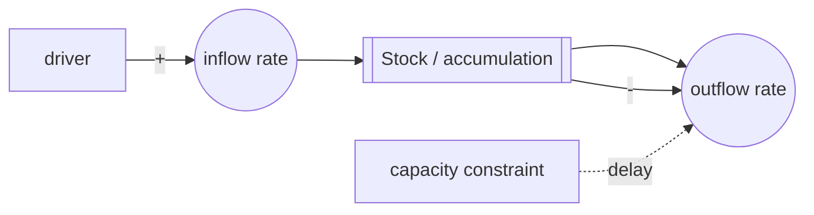

# Systems Thinking Tools

This reference supports the `systems-thinking-mapper` skill. Load it when creating diagrams, reviewing a model, or choosing between systems-thinking tools.

For a beginner-friendly learning path, use `tutorial.md` instead of this quick-reference file.

## Contents

- Tool selection
- Causal loop notation
- Mermaid causal loop template
- Mermaid stock-flow sketch
- Behavior-over-time sketch
- Diagram reading walkthrough template
- Common archetypes
- Leverage review checklist
- Model critique checklist

## Tool selection

Use a behavior-over-time graph when:

- The user describes a trend, oscillation, recurring crisis, boom-bust cycle, or slow drift.
- The first job is to clarify "what is changing over time?"

Use a causal loop diagram when:

- The user wants to see feedback, incentives, unintended consequences, or recurring patterns.
- The structure is mostly qualitative.

Use a stock-flow sketch when:

- Backlogs, debt, knowledge, cash, inventory, demand, morale, fatigue, or trust accumulate.
- Delays and rates explain why the system resists quick fixes.

Use a leverage map when:

- The user already has a causal model and wants intervention options.
- The output should compare where to act, not just explain what is happening.

Use a reading walkthrough when:

- The user is unfamiliar with systems thinking.
- The diagram has more than one feedback loop.
- The user asks what a diagram means, where to start, or how to explain it to others.

## Causal loop notation

- `A -- "+ " --> B`: A and B move in the same direction, all else equal.
- `A -- "- " --> B`: A and B move in opposite directions, all else equal.
- `A -. "delay" .-> B`: the effect has a meaningful time lag.
- `R`: reinforcing loop, which amplifies growth or decline.
- `B`: balancing loop, which counters change or seeks a goal.

A causal link should pass this test: "If A increases, what happens to B compared with what otherwise would have happened?"

Classify a loop by multiplying the link polarities:

- Zero or an even number of `-` links: reinforcing loop.
- Odd number of `-` links: balancing loop.

Do not classify a loop from the story alone; trace every link around the cycle.

## Mermaid causal loop template



Use Mermaid labels for loop names, but explain the actual loop path in prose beneath the diagram.

## Mermaid stock-flow sketch



In prose, state the stock's unit, the inflow unit per time, and the outflow unit per time when known.

Stock-flow discipline:

- A stock is a state at a point in time.
- A flow is a rate over time.
- A stock changes only through inflows and outflows.
- Other variables may influence flow rates, but should not directly add to or subtract from a stock.

## Behavior-over-time sketch

Mermaid is weak for charts. If the user needs a quick conceptual graph, use a small table:

| Time | Outcome |
| --- | --- |
| Now | high and rising |
| Next month | temporary dip |
| Next quarter | rebounds higher |

Then describe the curve shape in words. If the repository has charting tooling or the user wants an image, create an actual chart with the available project stack.

## Diagram reading walkthrough template

Use this structure to teach a beginner how to read a diagram:

1. What pattern is this diagram explaining?
2. What are the 2-3 most important variables?
3. What does each symbol mean in this specific diagram?
4. Read the dominant loop from one variable back to itself.
5. Identify delays and accumulations because they often explain surprises.
6. Ask what intervention changes the loop, not just the symptom.

Example phrasing:

```text
Start with customer wait time. The diagram is trying to explain why it rises, briefly improves, then rises again. Follow B1 first: more wait time increases pressure to hire, hiring raises capacity after a delay, and more capacity reduces wait time. Then follow R1: more wait time lowers trust, lower trust increases escalations, and escalations consume capacity, which raises wait time further.
```

## Common archetypes

### Fixes that fail

A quick fix improves a symptom in the short term, but creates a delayed side effect that worsens the symptom later.

Look for:

- Pressure to act quickly.
- A symptom-improving intervention.
- A delayed unintended consequence.

### Shifting the burden

A symptomatic solution reduces pressure to invest in a fundamental solution, making dependence on the symptomatic solution grow.

Look for:

- Repeated workarounds.
- Declining capability to solve the root issue.
- Addiction-like dependence on the workaround.

### Limits to growth

A reinforcing growth process runs into a balancing constraint.

Look for:

- Early success followed by plateau.
- Capacity, attention, market, trust, quality, or coordination limits.

### Escalation

Two actors respond to each other's actions, creating a reinforcing spiral.

Look for:

- Competitive retaliation.
- Defensive reactions.
- Success measured relative to the other party.

### Success to the successful

Early advantage attracts more resources, which increases future advantage.

Look for:

- Resource allocation based on recent performance.
- Winner-take-more dynamics.
- Neglected alternatives that never get the chance to improve.

## Leverage review checklist

For each candidate intervention, answer:

- Which loop or stock does this target?
- Does it change a parameter, information flow, rule, goal, or mental model?
- What delay should we expect before results appear?
- What leading indicator would show the model is working?
- What side effect might the system produce?
- What small experiment can test this safely?

## Model critique checklist

Before finalizing a diagram, check:

- Are all variables directional and measurable enough?
- Are polarities defensible?
- Are important delays shown?
- Are feedback loops named and explained?
- Are stocks separated from flows?
- Are external causes used sparingly?
- Does the model explain behavior over time?
- Are assumptions clearly marked?
